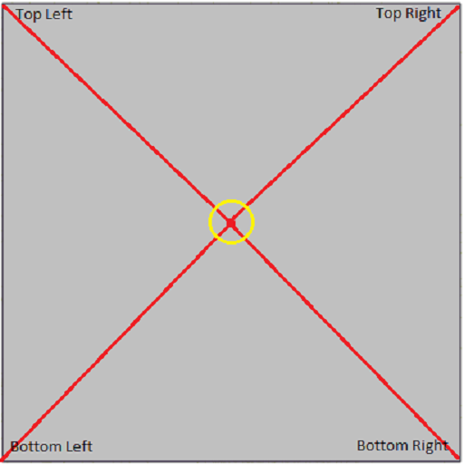
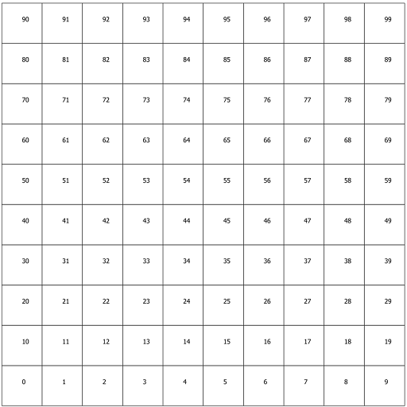

<!-- ABOUT THE PROJECT -->
## Solution1 (Create Extent from a provided center point)
It is a solution of creating Extent area from user provided center point & required
area size in KM-Square. Required Library [Dotsaptial]
Just use these lines of code to implement. 

	var extent = GeometryHelper.GetExtentFromCenterCoordinate(new DotSpatial.Topology.Coordinate(90.399555, 23.811016), 2.0);
  	var status = GeometryHelper.CreateExtentShapeFile(
                            extent,
                            @"C:\Extent.shp",
                            @"C:\Extent.txt"
                        );

## Demo Output 

## Solution2 (Create Grid from a provided extent and area square in KM)
This solution is help to create Grid from a provided extent, in addition have to 
provide user's required grid cell size in Square-KM

	var extent_feature = FeatureSet.Open(@"C:\Extent.shp");
   	GeometryHelper.CreateGrid(extent_feature.Extent, 1, @"C:\Grid.shp");

## Demo Output 
